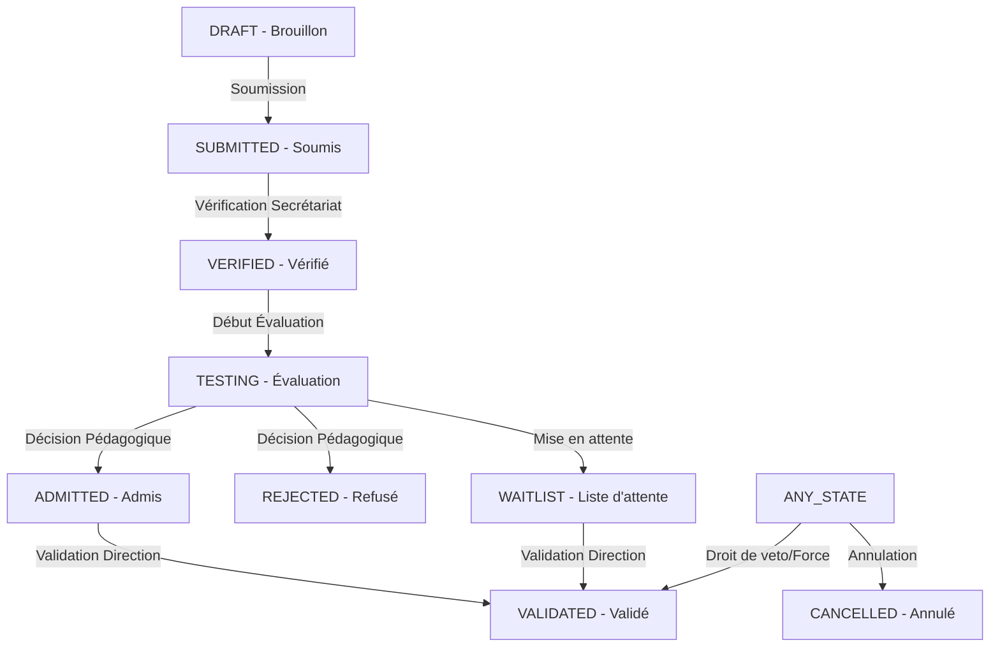

# Cycle de Vie & Workflow des Admissions

Ce document détaille les différents états d'une demande d'admission et les actions (endpoints) qui permettent de passer d'un état à l'autre.

## 1. Schéma Global du Workflow

---

## 2. Détail des États et Transitions

### ÉTAPE 1 : Création & Soumission
*   **État Initial :** `DRAFT` (Le parent remplit le dossier).
*   **Action :** `submit()`
*   **Transition :** `DRAFT` → `SUBMITTED`
*   **Endpoint :** `POST /api/v1/public/admissions/{id}/submit`
*   **Condition :** Les champs obligatoires (Identité, Scolarité) doivent être remplis.

### ÉTAPE 2 : Vérification Administrative (Secrétariat)
*   **État Initial :** `SUBMITTED`
*   **Action :** `verify()`
*   **Transition :** `SUBMITTED` → `VERIFIED`
*   **Endpoint :** `PATCH /api/v1/admin/admissions/{id}/verify`
*   **Rôle :** Admin / Secrétariat.

### ÉTAPE 3 : Évaluation Pédagogique
*   **État Initial :** `VERIFIED`
*   **Action :** `assess()` (Saisie des notes et décision)
*   **Transition :** `VERIFIED` → `TESTING` → (`ADMITTED` ou `REJECTED`)
*   **Endpoint :** `PATCH /api/v1/admin/admissions/{id}/assessment`
*   **Note :** Si la décision de l'évaluation est "ADMITTED", le statut passe automatiquement à `ADMITTED`.

### ÉTAPE 4 : Validation Finale (Direction)
*   **État Initial :** `ADMITTED` ou `WAITLIST`
*   **Action :** `validate()`
*   **Transition :** `ADMITTED` / `WAITLIST` → `VALIDATED`
*   **Endpoint :** `PATCH /api/v1/admin/direction/admissions/{id}/validate`
*   **Condition :** **Verrou Numérique** : Toutes les pièces obligatoires doivent avoir été uploadées ou reçues physiquement.

---

## 3. Actions Spéciales & Exceptions

| Action | Transition | Endpoint | Description |
| :--- | :--- | :--- | :--- |
| **Direct Entry** | (Néant) → `SUBMITTED` | `POST /api/v1/admin/admissions/direct` | Saisie rapide au guichet par un agent (saute l'étape DRAFT). |
| **Overrule** | (Importe) → `VALIDATED` | `PATCH /api/v1/admin/direction/admissions/{id}/overrule` | La direction force la validation (ignore le verrou numérique). |
| **Waitlist** | (Importe) → `WAITLIST` | `PATCH /api/v1/admin/direction/admissions/{id}/waitlist` | Placement manuel en liste d'attente. |
| **Reject** | (Importe) → `REJECTED` | `PATCH /api/v1/admin/direction/admissions/{id}/reject` | Rejet manuel du dossier par la direction. |
| **Cancel** | (Importe) → `CANCELLED` | `POST /api/v1/admin/admissions/{id}/cancel` | Annulation définitive du dossier. |

---

## 4. Gestion des Documents
La gestion des documents peut se faire en parallèle du workflow d'état, mais impacte la transition vers `VALIDATED`.

*   **Upload (Parent) :** `POST /api/v1/public/admissions/{id}/documents/{docCode}`
*   **Réception Physique (Admin) :** `PATCH /api/v1/admin/admissions/{id}/documents/{docName}/receive`
